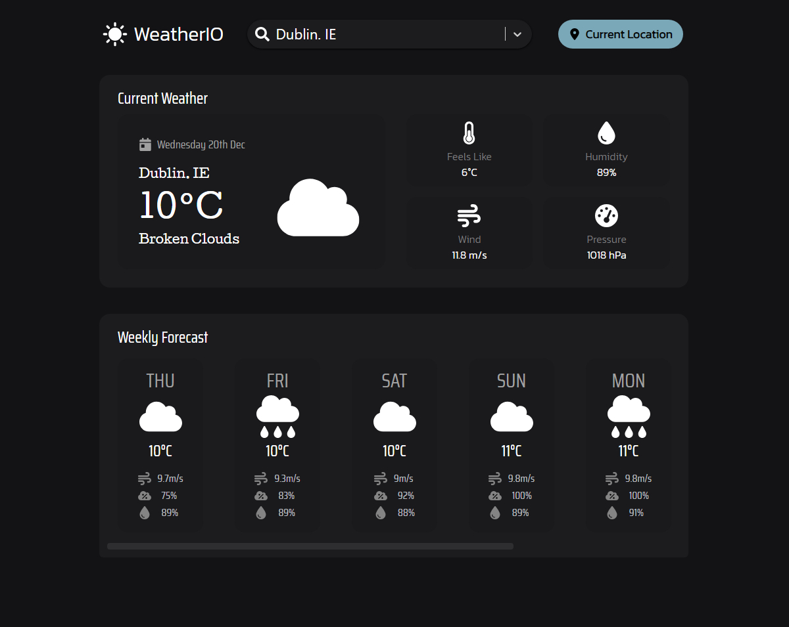

# Weather IO

## Introduction



Weather IO is your go-to source for accurate and real time weather information. Easily search for locations and receive instant, accurate weather updates powered by the OpenWeatherMap API, where you will receive a detailed overview of the current weather and a weekly forecast. Need the weather for your exact location? Hit the "Current Location" button, and the app fetches weather details for you.

## Frameworks & Libraries

-   **[Tailwind CSS](https://tailwindcss.com/)**

    -   A utility-first CSS framework. Tailwind CSS is used for styling and creating a responsive design.

-   **[react-icons](https://react-icons.github.io/react-icons/)**

    -   A collection of popular icons as React components. Used to incorporate a multitude of scalable and customisable icons in the application.

-   **[date-fns](https://date-fns.org/)**

    -   A modern JavaScript date utility library. Used for efficient date formatting and manipulation.

-   **[react-select-async-paginate](https://www.npmjs.com/package/react-select-async-paginate)**

    -   A react-select wrapper with built-in support for asynchronous data fetching and pagination. Used for handling asynchronous loading of location suggestions in the search bar.

-   **[prop-types](https://www.npmjs.com/package/prop-types)**

    -   Runtime type checking for React props. Ensures the correctness of data passed to components.

-   **[react-loading-skeleton](https://www.npmjs.com/package/react-loading-skeleton)**

    -   A lightweight React library for creating skeleton loading animations. Provides users with a visual indication of when content is being loaded during data fetching.

## APIs Used

-   **[OpenWeatherMap API](https://openweathermap.org/api)**

    -   Provides real time weather data, including current conditions and the weekly forecasts, based on user-selected or current locations. Includes information such as:
        -   Current Temperature
        -   Weather Description
        -   Humidity
        -   Wind Speeds
        -   Pressure
        -   Cloud Coverage

-   **[GeoDB Cities API](https://rapidapi.com/wirefreethought/api/geodb-cities)**

    -   Offers real time suggestions of cities based on user input in the search bar. Enhances the user experience by providing dynamic and accurate city suggestions as users type.

-   **[Reverse Geocoding & Geolocation API](https://rapidapi.com/Noggle/api/reverse-geocoding-and-geolocation-service/)**
    -   Translates geographical coordinates into a human-readable address. Used to determine the user's location when the _"Current Location"_ button is clicked.

## Getting Setup

Before running the Weather IO Web application, make sure you follow the instructions below in order to setup everything correctly.

### Prerequisites

-   **[Node.js](https://nodejs.org/en)**

    -   Ensure that Node.js and npm are installed on your machine.

-   API Keys:
    -   **[OpenWeatherMap API Key](https://home.openweathermap.org/)**
        -   Sign up and obtain your API key for weather data at the following link: [API Key](https://home.openweathermap.org/api_keys).
    -   **[RapidAPI Key](https://rapidapi.com/hub)**
        -   Sign up and obtain a RapidAPI key for accessing the GeoDB Cities and Reverse Geocoding & Geolocation APIs.

### Installation

Follow these steps to set up and run the project:

1. **Clone the Project:**\
   `git clone https://github.com/Mubarak-O/weather-app.git`
2. **Install Dependencies:**\
   `npm install`
3. **Set Up Environment Variables:**
    - Create a `.env` file in the root directory.
    - Add the following lines to the `.env` file, replacing `YOUR_OPENWEATHERMAP_API_KEY` and `YOUR_RAPIDAPI_KEY` with your actual API keys:
    ```
    VITE_GEO_API_KEY=YOUR_RAPIDAPI_KEY
    VITE_WEATHER_API_KEY=YOUR_OPENWEATHERMAP_API_KEY
    ```
4. **Run the Application:**\
   Spin up the development server by running: `npm run dev`.
   The Weather IO web applications should be accessbile at `http://localhost:5173` in your browser.
